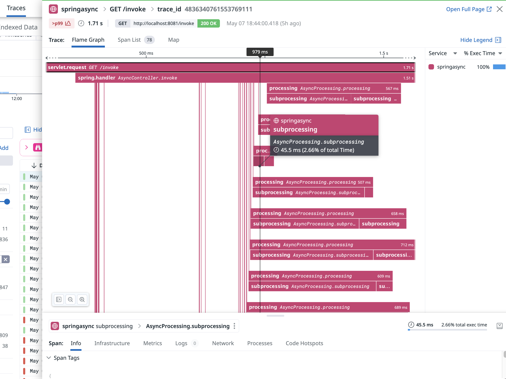

# Instrumenting a spring boot application using Datadog


## Introduction


The sections of this tutorial are structured as follows

* Goal
* Pre-requisites
* Clone the repository
* Directory structure of the [project](#project)
* Overview of the [application](#overview)
* Building and running the [application](#app)
* [Testing](#testing) the application
* Building the application and running it on a [kubernetes](#k8s) cluster
* End

In each section, we'll describe the required steps to take in order to reach the goal.


## Goal of this lab

The purpose of this lab is to use and set up a spring boot application using various async activities and instrumenting it with Datadog. More specifically this service will be focusing on CPU overhead and will simulate high CPU times.


## Pre-requisites


+ About 10 minutes
+ A java JDK (If building & running locally). Ex OpenJDK 11 or above
+ Gradle installed (If building & running locally). Ex Gradle 7.5.1
+ Git client
+ A Datadog account with a valid API key
+ Your favorite text editor or IDE (Ex Sublime Text, Atom, vscode...)
+ Docker and docker-compose.


## Clone the repository


<pre style="font-size: 12px">
[root@pt-instance-6:~/]$ git clone https://github.com/ptabasso2/async
[root@pt-instance-6:~/]$ cd async
[root@pt-instance-6:~/async]$ 
</pre>


## Directory structure of the <a name="project"></a>project


The example below is the structure after having clone the project.

```shell
[root@pt-instance-6:~/async]$ tree
.
├── Dockerfiles
│   └── Dockerfile.springasync
├── README.md
├── dd-java-agent.jar
├── docker-compose.yml
├── k8s
│   ├── datadog
│   │   └── values.yaml
│   └── deployment.yaml
└── springasync
    ├── build
    │   ├── classes
    │   │   └── java
    │   │    ...
    │   ├── generated
    │   │   └── sources
..
    │   ├── libs
    │   │   └── async-method-0.0.1-SNAPSHOT.jar
    │   └── tmp
    │       ├── bootJar
    │       │   └── MANIFEST.MF
    │       └── compileJava
    │           └── source-classes-mapping.txt
    ├── build.gradle
    ├── dd-java-agent.jar
    ├── gradle
    │   └── wrapper
    │       ├── gradle-wrapper.jar
    │       └── gradle-wrapper.properties
    ├── gradlew
    ├── settings.gradle
    └── src
        └── main
            └── java
                └── com
                    └── example
                        └── asyncmethod
                            ├── AsyncController.java
                            ├── AsyncMethodApplication.java
                            ├── ThreadPoolTaskExecutorService.java

```

## Overview of the <a name="overview"></a>application


The main components of this service can be described as follows:
+ A single microservice (`springasync` ) that can be configured to spin up as many threads as needed through `-Dthreadnum` and the number of iterations to execute an arithmetic instruction
through `-Diteration`. If not specified, both parameters have default values which are respectively (`20` and `10000`).
+ The various docker files needed to build the images and the `docker-compose` configuration file to spin up the two containers (`dd-agent-dogfood-jmx`, `springasync`).
+ Custom instrumentation using the `OpenTelemetry API` to add the spans related to the methods performing the computation steps.
+ The various configuration files for having the application deployed on a `k8s` environment (helm chart for the DD agent and a deployment manifest to deploy the application).

## Building <a name="app"></a> and running the project ##

````shell
[root@pt-instance-6:~/async]$ cd springasync
[root@pt-instance-6:~/async/springasync]$ gradle build

BUILD SUCCESSFUL in 10s
[root@pt-instance-6:~/async/springasync]$ nohup java -jar build/libs/async-method-0.0.1-SNAPSHOT.jar &
[1] 19870
[root@pt-instance-6:~/springasync/springasync]$ nohup: ignoring input and appending output to 'nohup.out'
````

The service is started and listens on port `8080` and exposes an endpoint `/invoke` 


````shell
[root@pt-instance-6:~/async/springasync]$ curl localhost:8080/invoke
Processing done...
````

Everything is now in place. We can now start instrumenting this service.

## Starting the Datadog Agent ##

First set your API Key:

````shell
[root@pt-instance-6:~/async]$ export DD_API_KEY=<Your api key>
````

Then let's run the agent. As docker is installed on our environment, we will use a dockerized version of the agent. 

But if you wish to have it deployed as a standalone service you will want to follow the instructions as per [Datadog Agent installation](https://app.datadoghq.com/account/settings?_gl=1*17qq65s*_gcl_aw*R0NMLjE2NzY0Mzg4NTcuQ2p3S0NBaUFfNnlmQmhCTkVpd0FrbVh5NTcxNlplWmxIQ3RBS0MwdWdUeWIyNnZSRGN1Q01YUHJoZHlYU2Zaekt4eTNNZjZST1I4SVVSb0NwT2NRQXZEX0J3RQ..*_ga*NzYyNTQxODI3LjE2MDExNDI4ODA.*_ga_KN80RDFSQK*MTY3NjgwOTY3NS4zMC4xLjE2NzY4MDk3MDQuMzEuMC4w#agent/ubuntu)


By default, the Datadog Agent is enabled in your `datadog.yaml` file under `apm_config` with `enabled: true` and listens for trace data at `http://localhost:8126`


````shell
[root@pt-instance-6:~/async]$ docker run -d --network app --name dd-agent-dogfood-jmx -v /var/run/docker.sock:/var/run/docker.sock:ro \
-v /proc/:/host/proc/:ro \
-v /sys/fs/cgroup/:/host/sys/fs/cgroup:ro \
-v /home/pej/conf.d/:/etc/datadog-agent/conf.d \
-p 8126:8126 -p 8125:8125/udp \
-e DD_API_KEY \
-e DD_APM_ENABLED=true \
-e DD_APM_NON_LOCAL_TRAFFIC=true -e DD_PROCESS_AGENT_ENABLED=true -e DD_DOGSTATSD_NON_LOCAL_TRAFFIC="true" -e DD_LOG_LEVEL=debug \
-e DD_LOGS_ENABLED=true \
-e DD_LOGS_CONFIG_CONTAINER_COLLECT_ALL=true \
-e DD_CONTAINER_EXCLUDE_LOGS="name:datadog-agent" \
-e SD_JMX_ENABLE=true \
gcr.io/datadoghq/agent:latest-jmx
Unable to find image 'gcr.io/datadoghq/agent:latest-jmx' locally
latest-jmx: Pulling from datadoghq/agent
8dbf11a29570: Pull complete 
Digest: sha256:c7fe7c8d15f259185ab0c60dbfb7f5cbc67d09b5749af0d2fee45cefe2ccb05f
Status: Downloaded newer image for gcr.io/datadoghq/agent:latest-jmx
2d1eec89c2196d298d1e3edf1e9f879c0fc3be593d96f1469cfacc2cacfc18b4
````

## Instrumenting the service ##

````
[root@pt-instance-6:~/async/springasync]$ nohup java -javaagent:dd-java-agent.jar -Ddd.service=springasync -Ddd.env=dev -Ddd.version=12 -Ddd.tags=env:dev -Ddd.profiling.enabled=true -XX:FlightRecorderOptions=stackdepth=256 -Ddd.profiling.ddprof.cpu.enabled=true -Ddd.trace.otel.enabled=true -Diteration=500000 -jar build/libs/async-method-0.0.1-SNAPSHOT.jar &
[1] 19890
[root@pt-instance-6:~/springasync/springasync]$ nohup: ignoring input and appending output to 'nohup.out'
````

Now by running a few curl commands on `/invoke`, and after a few seconds, we can check that our service is being instrumented and that the details are reflected in this trace flamegraph. 


<p align="left">
  
</p>


## Using docker compose ##

 
* Do make sure to set your API Key before running the following command:

````shell
[root@pt-instance-6:~/async]$ export DD_API_KEY=<Your api key>
````

* Then run the following:

````shell
[root@pt-instance-6:~/async]$ docker-compose up -d
Creating dd-agent-dogfood-jmx ... done
Creating springasync          ... done
````


Let's check the status of our containers:

````shell
[root@pt-instance-6:~/async]$ docker-compose ps
        Name                      Command                  State                                                  Ports                                            
-------------------------------------------------------------------------------------------------------------------------------------------------------------------
dd-agent-dogfood-jmx   /bin/entrypoint.sh               Up (healthy)   0.0.0.0:8125->8125/tcp,:::8125->8125/tcp, 8125/udp, 0.0.0.0:8126->8126/tcp,:::8126->8126/tcp
springasync            /bin/sh -c java -jar sprin ...   Up             0.0.0.0:8080->8080/tcp,:::8080->8080/tcp 
````

And now testing them to see if the application is functional.

````shell
[root@pt-instance-6:~/async]$ curl localhost:8080/invoke
Processing done...
````


When you are done with those services, you can tear them down by running this command

````shell
[root@pt-instance-6:~/async]$ docker-compose down
Stopping dd-agent-dogfood-jmx ... done
Stopping springasync          ... done
Removing dd-agent-dogfood-jmx ... done
Removing springasync          ... done
Removing network app

````


## Deploying and running the application <a name="k8s"></a> on a kubernetes cluster ##


When ready you can run the agent installation process. In our case we will do so by using helm.

````shell
[root@pt-instance-6:~/async]$ helm install ddagent -f k8s/datadog/values-with-lib-conf.yaml  --set datadog.apiKey=<your API key> datadog/datadog --set targetSystem=linux
NAME: ddagent
LAST DEPLOYED: Mon Feb 27 09:58:51 2023
NAMESPACE: default
STATUS: deployed
REVISION: 1
TEST SUITE: None
NOTES:
Datadog agents are spinning up on each node in your cluster. After a few
minutes, you should see your agents starting in your event stream:
    https://app.datadoghq.com/event/explorer

###################################################################################
####   WARNING: Cluster-Agent should be deployed in high availability mode     ####
###################################################################################

The Cluster-Agent should be in high availability mode because the following features
are enabled:
* Admission Controller

To run in high availability mode, our recommandation is to update the chart
configuration with:
* set `clusterAgent.replicas` value to `2` replicas .
* set `clusterAgent.createPodDisruptionBudget` to `true`.
````


After a couple of minutes, the various components tied to the datadog agent will be deployed (datadog cluster agent and datadog agent on each node of the cluster)

````shell
[root@pt-instance-6:~/async]$ kubectl get pods
NAME                                             READY   STATUS    RESTARTS   AGE
ddagent-datadog-2p5pk                            4/4     Running   0          60s
ddagent-datadog-cluster-agent-58b6784789-kfgw2   1/1     Running   0          59s
ddagent-datadog-pvcxt                            4/4     Running   0          60s
ddagent-datadog-x7zgj                            4/4     Running   0          60s
ddagent-kube-state-metrics-6df45df688-b5gfn      1/1     Running   0          59s
````

Deploying the application

````shell
[root@pt-instance-6:~/async]$ kubectl apply -f k8s/deployment.yaml 
deployment.apps/springasync created
service/springasync created
````


## Testing the <a name="testing"></a> application ##

We can now curl the enpoint by using the external IP of the service or using port forwarding as follows:

````shell
[root@pt-instance-6:~/async]$ kubectl port-forward springasync-744df487f9-svhfq 8081:8080
Forwarding from 127.0.0.1:8081 -> 8080
Forwarding from [::1]:8081 -> 8080
Handling connection for 8081

````

In another terminal you can run 

````shell
[root@pt-instance-6:~/async]$ curl localhost:8081/invoke
Processing done...
````


## End ##

